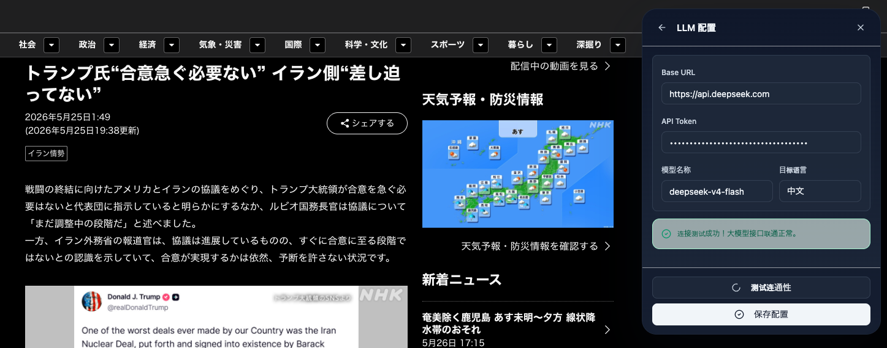
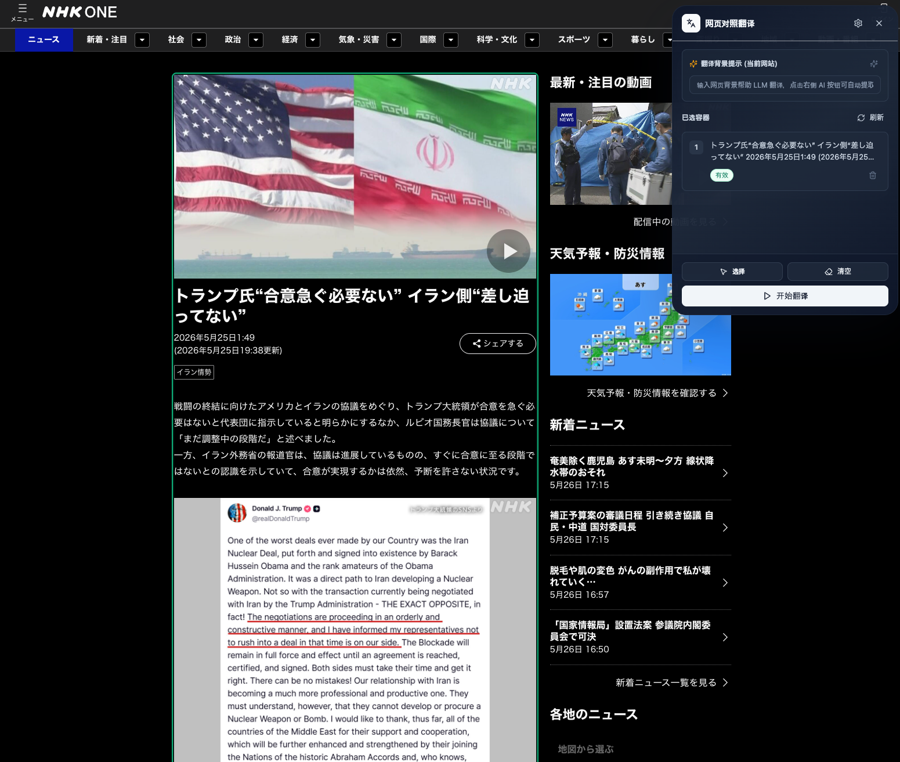
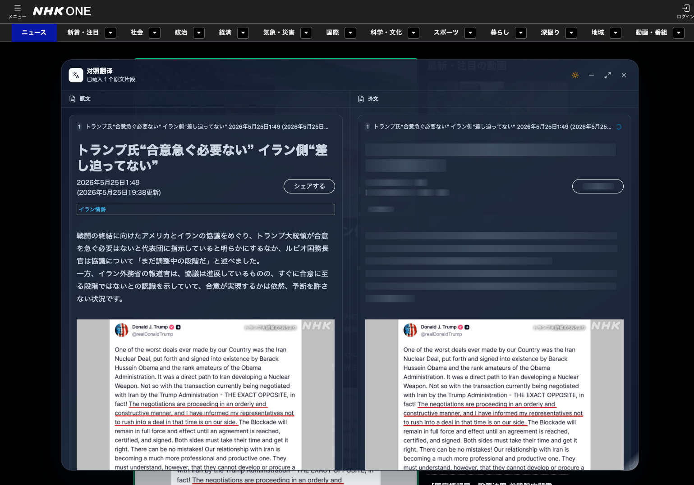
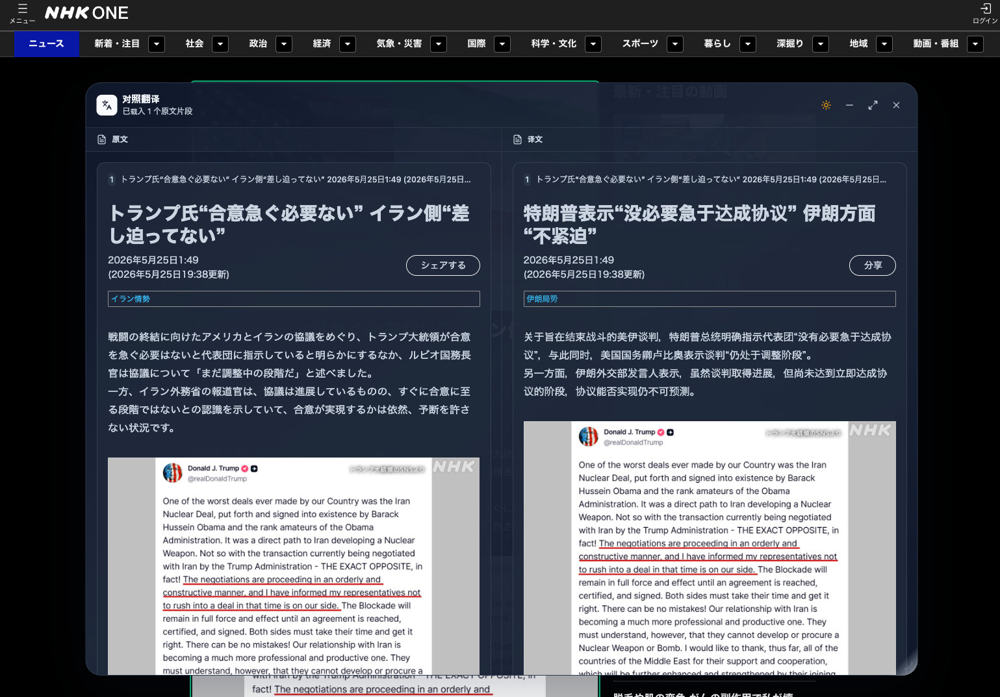

# 网页对照翻译浏览器插件 (page-translate-ext)

page-translate-ext 是一款基于 **WXT** 扩展框架、**React** 和 **TypeScript** 开发的高颜值、轻量级网页对照翻译浏览器插件。

与传统“全文机翻破坏网页排版”的插件不同，本项目支持用户**自由选择网页中的任意文本容器（如文章正文、特定卡片等）**，并通过**安全的 DOM 快照克隆技术**，在一个**独立的、支持拖拽和缩放的左右双栏弹窗**中，实现原网页样式的高保真对照翻译。同时，用户可以自由配置任何兼容 OpenAI 格式的大语言模型 (LLM) 接口，享受灵活、高质量的定制翻译体验。

---

## 📖 目录

1. [🌟 核心特性](#-核心特性)
2. [🛠️ 技术栈](#️-技术栈)
3. [📂 项目架构与目录结构](#-项目架构与目录结构)
4. [🚀 安装与开发指南](#-安装与开发指南)
5. [💡 完整使用工作流](#-完整使用工作流)
6. [🔒 安全与健壮性设计](#-安全与健壮性设计)

---

## 🌟 核心特性

- 🎯 **智能容器选择 (Inspect Mode)**：
  - 点击“选择”进入可视化元素高亮选择状态。
  - 采用排他性与替换法则：支持直接取消已选父容器的子元素、或点击子元素的父容器时自动替换，确保已选容器集合**不嵌套、不重叠**。
  - 即使页面滚动或窗口尺寸变化，高亮位置仍旧精准。

- 📑 **左右双栏对照阅读**：
  - 翻译结果在独立的 Shadow DOM 弹窗中进行左右分栏渲染，左栏为高保真原文克隆，右栏为实时翻译内容，不污染宿主页面本身。
  - 支持**拖拽 (Drag)**、**缩放 (Resize)**、**一键最大化/还原**，以及**最小化到右下角悬浮入口**，操作如操作系统原生窗口般流畅。

- 🧠 **大粒度分片并发翻译 (1800字逻辑切片)**：
  - 基于“最近块级祖先”在内存中将翻译 ID 归类段落，避免句子被跨分片切断，最大化保留大模型的上下文语义。
  - 单个 Chunks 限制为 1800 字符，通过 XML (`[tX]`) 极简带标模式交互，在 Prompt 层面保证了倒装句对齐，消除了标签错位。
  - 内置全局并发限流（最大并发度为 6），在接收到响应时驱动局部卡片增量局部重绘与 Shimmer 骨架屏流式渐进回填，无死锁安全兜底。

- 🎨 **无缝主题自适应与色彩冲突修复**：
  - **默认皮肤感知**：自动读取系统的深浅色主题偏好（`prefers-color-scheme`），作为 Popup 面板和翻译弹窗的默认主题。
  - **手动一键切换**：支持在弹窗 Header 手动切换太阳/月亮模式，并通过 `chrome.storage.local` 进行本地持久化记忆。
  - **万能字色继承**：全局注入字色继承规则，强行将原网页文字颜色在暗黑弹窗下适配为白字、在浅色弹窗下适配为深色字，彻底解决“黑底黑字”的字色错配难题，同时不损害代码块的语法高亮。

- 💅 **样式物理分离与 WXT 冲突避让**：
  - 将所有 Shadow DOM 弹窗样式抽取至独立的 `_content.css` 中，通过 Vite `?raw` 原生文本加载器读取并内联注入。
  - 采用下划线 `_` 前缀的命名规避了 WXT 自动扫描常规文件为入口打包引起的构建冲突。

---

## 🛠️ 技术栈

- **扩展开发框架**：[WXT](https://wxt.dev/) (下一代 Manifest V3 浏览器扩展工具)
- **前端 UI 框架**：React 18 + TypeScript + PostCSS
- **样式系统**：Tailwind CSS (构建于 Shadow Root 安全沙箱内)
- **核心交互依赖**：`react-draggable` (拖拽控制), `react-resizable` (窗口缩放)
- **图标库**：`lucide-react`

---

## 📂 项目架构与目录结构

项目按高内聚低耦合原则组织：

```text
├── entrypoints/                      # 扩展打包入口目录
│   ├── background.ts                 # Background Service Worker（规避CORS，测试连通性与LLM API转发）
│   ├── content.tsx                   # Content Script（核心注入脚本，渲染管理面板与对照翻译弹窗）
│   ├── _content.css                  # Content 专用样式（样式分离，下划线前缀避免构建同名冲突）
│   └── popup/                        # 插件 Popup UI 目录（注：当前已被 content 网页内悬浮面板所融合）
│       ├── App.tsx                   # 容器管理与配置面板入口
│       └── style.css                 # 弹窗与控制台的基础 CSS 变量与 Tailwind 引入
│
├── components/                       # React 业务组件
│   ├── floating-window/
│   │   └── TranslationWindow.tsx     # 对照翻译结果弹窗组件（拖拽、缩放、最大化、最小化及流式回填）
│   ├── popup/
│   │   ├── ContainerManager.tsx      # 已选网页容器管理面板组件
│   │   └── SettingsPanel.tsx         # 大模型 API 与目标语言配置面板组件
│   └── ui/                           # 原子级基础 UI 组件（shadcn/ui 风格）
│
├── utils/                            # 工具函数库
│   ├── dom/
│   │   ├── readable-snapshot.ts      # 生成保留样式的安全阅读 DOM 快照
│   │   ├── selection-controller.ts   # 元素 Inspect 选择、高亮 overlay 与排他逻辑控制器
│   │   ├── theme.ts                  # 宿主页面与系统深暗偏好自适应检测
│   │   └── xml-converter.ts          # 段落分片、DOM文本节点 XML 互转与局部还原回填
│   └── storage/
│       └── config.ts                 # 基于 chrome.storage.local 的持久化配置读写
```

主要模块文件链接：

- 核心服务脚本：[entrypoints/background.ts](file:///Users/yuanyuanzi_/Documents/page-translate-ext/entrypoints/background.ts)
- 核心页面注入：[entrypoints/content.tsx](file:///Users/yuanyuanzi_/Documents/page-translate-ext/entrypoints/content.tsx)
- 样式隔离规则：[entrypoints/\_content.css](file:///Users/yuanyuanzi_/Documents/page-translate-ext/entrypoints/_content.css)
- 对照翻译弹窗：[components/floating-window/TranslationWindow.tsx](file:///Users/yuanyuanzi_/Documents/page-translate-ext/components/floating-window/TranslationWindow.tsx)
- 元素选择器：[utils/dom/selection-controller.ts](file:///Users/yuanyuanzi_/Documents/page-translate-ext/utils/dom/selection-controller.ts)
- 快照生成器：[utils/dom/readable-snapshot.ts](file:///Users/yuanyuanzi_/Documents/page-translate-ext/utils/dom/readable-snapshot.ts)
- XML分片与回填：[utils/dom/xml-converter.ts](file:///Users/yuanyuanzi_/Documents/page-translate-ext/utils/dom/xml-converter.ts)

---

## 🚀 安装与开发指南

### 1. 安装依赖

推荐使用 `pnpm` 包管理器：

```bash
pnpm install
```

### 2. 启动开发模式

在本地启动开发热重载服务。WXT 会自动启动一个干净的 Chrome 浏览器实例并默认加载该扩展：

```bash
pnpm dev
```

### 3. 类型检查与代码构建

运行静态类型检查：

```bash
pnpm typecheck
```

构建生产环境扩展产物：

```bash
pnpm build
```

打包后的产物将生成在 `.output/` 文件夹下。你可以将对应的文件夹以“加载已解压的扩展程序”形式手动装载到你的常用浏览器中。

---

## 💡 完整使用工作流

1. **唤起管理面板**：
   在浏览器中打开任意页面，点击浏览器右上角的 **page-translate-ext** 插件图标，会在网页右上角以独立的 Shadow DOM 渲染出一个悬浮的**容器管理面板**。

2. **配置大模型参数 (首发必看)**：
   - 点击容器管理面板右上角的 **齿轮（设置）** 按钮切换至配置面板。
   - 输入你所持有的大模型参数：**Base URL**、**API Token**、**模型名称**以及**目标语言**。
   - 配置完成后，点击 **“测试连通性”** 按钮。如果提示“连接成功”，点击 **“保存”**。
     
3. **进入可视化选择模式**：
   - 点击管理面板中的 **“选择”** 按钮。
   - 此时鼠标在网页移动时，会被 hover 到的块级元素自动加上蓝色阴影与外框高亮。

   - 确认选择某段落/区域后，点击鼠标左键。已选择的区域会在管理面板列表中即时同步，并标上序号。你可以自由清空、删除不需要的元素。

     

4. **开启对照翻译**：
   - 点击管理面板下方的 **“开始翻译”** 按钮。
   - 插件将自动关闭管理面板，对所选容器生成安全的 DOM 快照并抽取待翻译文本，在后台通过 background.ts 将文本大粒度打包向大模型发出并发请求。

   - 页面会弹出一个优雅的**对照翻译窗口**，原文栏先于译文呈现，译文栏对应位置呈现流式 Shimmer 骨架屏加载状态。
   - 随着翻译片区的响应回填，骨架屏将渐进式地替换为流畅译文。

     

5. **对照窗口交互**：
   - 拖拽对照窗口的顶部标题栏以移动位置。
   - 拖动窗口右下角的小控制块以自由缩放高宽。
   - 点击右上角 **“最大化（矩形图标）”** 将窗口铺满屏幕；点击 **“还原”** 回弹至之前保存的自定义位置。
   - 点击 **“最小化（减号图标）”** 可使窗口折叠为页面右下角的悬浮恢复按钮，不销毁已翻译的内容；点击悬浮入口再次恢复。
     

---

## 🔒 安全与健壮性设计

1. **API Token 隐蔽**：
   API Token 仅存储在 `chrome.storage.local` 中，连通性测试与翻译请求全部依靠 background 转发，杜绝了向宿主 DOM 注入 Token 或被页面恶意脚本获取的风险。
2. **DOM 净化 (Sanitization)**：
   快照提取时采用白名单机制递归遍历。自动剥离原网页的 `script` 元素、所有 inline 事件属性（如 `onclick`）及 `javascript:` 等协议链接，并移除了原网页自带的内联背景色和不可见元素，规避跨站脚本 (XSS) 攻击与样式崩塌。
3. **极简大粒度 XML (`[tX]`) 通信**：
   仅将结构化的纯文本节点传递给大模型，而不传递任何 HTML。翻译回填由插件自身在本地 DOM 级别结合 `data-translate-id` 精准重塑，防范了大模型输出格式不受控导致的页面结构损坏。
4. **性能阈值限制**：
   - 单次最多选择容器数：**10 个**
   - 单次最多提取文本节点数：**500 个**
   - 单次最大翻译字符数：**30,000 字**
   - 超时强行中断判定：**60 秒**
